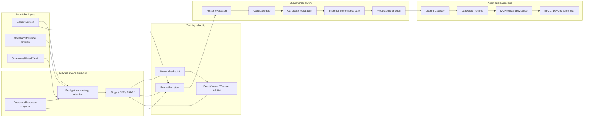
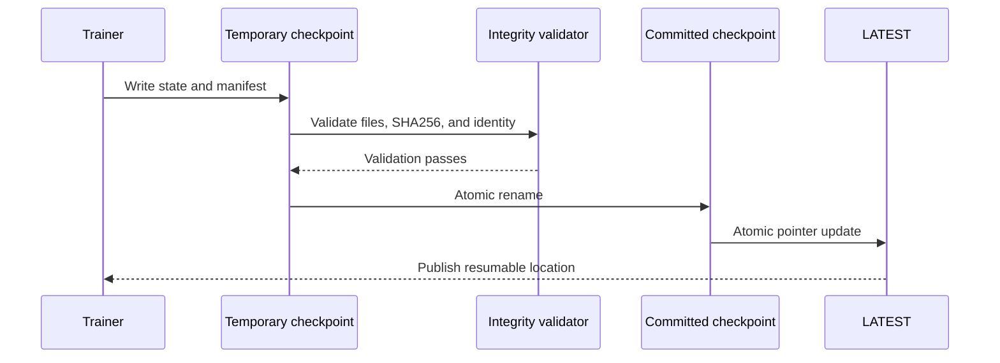
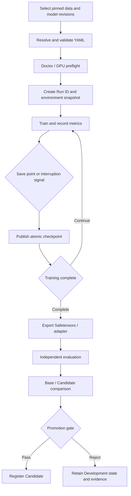

# TinyLLM-System

[简体中文](README.md) | **English**

> An LLM post-training, agent evaluation, and online inference platform for consumer
> multi-GPU workstations.

[](https://github.com/JayYu686/TinyLLM-System/actions/workflows/ci.yml)
[](https://www.python.org/downloads/)
[](LICENSE)

TinyLLM-System organizes data processing, training strategy, failure recovery, model
evaluation, and version promotion into one reproducible engineering lifecycle. Native
PyTorch provides the training core. The primary environment is a shared workstation with
10 × RTX 3090 24GB GPUs, where execution adapts to memory capacity, topology, and available
resources through single-device training, DDP, or FSDP2.
After M6, the lifecycle extends into online serving, tool calling, MCP, a single DevOps
agent, and dedicated agent-readiness evaluation.

Every experiment receives complete lineage, from pinned dataset/model revisions and
schema-validated YAML to the Git commit, software and hardware environment, checkpoints,
evaluation results, and deployment exports. Published conclusions are backed by reviewable
run evidence, while pending capabilities keep an explicit status.

## Problems addressed

| Engineering question | TinyLLM-System approach |
| -- | -- |
| What produced a training run? | A Run Manifest binds data, tokenizer, config, code, environment, and hardware identity |
| How can a job start safely on shared GPUs? | `tinyllm doctor`, utilization/temperature checks, topology capture, and strategy preflight |
| How does interrupted training continue? | Atomic checkpoints, complete training state, integrity checks, and explicit resume semantics |
| Which multi-GPU strategy fits the workload? | DDP for throughput when one device holds full state; FSDP2 when state sharding is required |
| How is a trained model accepted? | Frozen evaluation, Base/Candidate comparison, regression analysis, and a promotion gate |
| How can an experiment or deployment be reproduced? | The Artifact Store preserves facts and links deployment exports back to training and evaluation |

## Architecture



The complete lifecycle is:

```text
data versioning
  → hardware inspection and training planning
  → single-device or distributed training
  → checkpoint and failure recovery
  → automated evaluation and model comparison
  → candidate quality gate
  → inference performance gate
  → model registry, deployment, and experiment reproduction
```

## Core capabilities

### Traceable training

- Formal experiments start from Pydantic-schema-validated YAML.
- Run IDs combine UTC time, a slug, the resolved-config hash, and a random suffix.
- `run.json`, `config.resolved.json`, `environment.json`, `hardware.json`, and
  `metrics.jsonl` form the durable run record.
- Datasets, models, and tokenizers use pinned revisions; configuration drift changes
  experiment identity.

### Reliable checkpoint and resume

- Single-device/DDP runs save complete PyTorch state; FSDP2 uses
  `torch.distributed.checkpoint` for sharded state.
- Checkpoints cover model, optimizer, scheduler, scaler, step/epoch, RNG state, sampler
  cursor, dataset version, config hash, Git identity, environment, world size, and
  per-file SHA256.
- Publication uses a temporary directory, integrity validation, atomic rename, and an
  atomic `LATEST` update.
- Exact, Warm, and Transfer resume have separate validation rules. Safetensors serves as
  the deployment export format.



### Hardware-aware distributed training

| Strategy | State placement | Primary use | Project status |
| -- | -- | -- | -- |
| Single device | Full state on one GPU | Correctness baseline, small models, rapid debugging | Complete |
| DDP | Full state on every rank | Throughput scaling when full state fits one GPU | Verified on 1/2/4 GPUs |
| FSDP2 | Sharded parameters, gradients, and optimizer state | Training models constrained by per-device memory | Qwen3-8B verified on four GPUs |
| ZeRO-3 | DeepSpeed sharding with optional offload | Engineering and performance comparison after FSDP2 | Enhancement stage |

### Data, evaluation, and promotion

- Raw data passes normalization, license filtering, deduplication, grouped splitting,
  tokenization, packing, and registration.
- Dataset manifests record input hashes, processing config, output hashes, rejection
  statistics, and license distribution.
- Evaluation suites are independently versioned, frozen before training, and checked for
  train/evaluation contamination.
- Base and Candidate use identical prompt templates, tokenizer revisions, and decoding
  configuration.
- Promotion evaluates target-task gains, general regressions, structured-output quality,
  and lineage completeness together.

## Current status

| Milestone | Status | Verified result |
| -- | -- | -- |
| M0 host readiness | Complete | 10 RTX 3090s inventoried; CUDA/BF16 smoke; 1/2/4/6-GPU NCCL correctness |
| M1 single-device training | Complete | TinyGPT-Debug CPU forward/backward; CPU Exact Resume; RTX 3090 BF16 SIGTERM/SIGKILL recovery |
| M2 data and evaluation | Complete | Pinned-source full build and offline rebuild; frozen 300-item suite; Exact contamination scan; Qwen3-0.6B Baseline |
| M3 DDP | Complete | Initialization, sampler, loss reduction, rank-failure recovery, and real 1/2/4-GPU scaling |
| M4 FSDP2 | Complete | Qwen3-8B four-GPU BF16 FULL_SHARD; Step 25→50 DCP resume; independent Safetensors load |
| M5 dual-mode SFT | Complete | 0.6B four-GPU Full SFT over 50M tokens and 8B BF16 LoRA over 10M tokens; both routes completed Exact Resume, dual-mode evaluation, and export |
| M6 evaluation and promotion | Complete | Independent v7 dual-mode evaluation, 160 human judgments, 11/11 gates passed, and the 0.6B Full-SFT artifact registered as Candidate |
| M7 inference | Complete | Formal vLLM/Gateway matrix completed 18,000/18,000 requests; 9/9 Production checks passed; the 0.6B model was promoted |
| M8 DevOps agent | Complete | Tool calling 8/8; MCP, LangGraph, FTS5 retrieval, explicit approval, and restart recovery |
| M9 agent evaluation | Complete | Frozen 240-task DevOps Agent Suite; three parent baselines; 5,520/5,520 BFCL items with zero inference failures |
| M10 agent post-training | Closed (model gates rejected) | 0.6B Full SFT stopped at 5M and 8B LoRA at 1M after real Agent Dev gates; M7 Production remains unchanged |

Milestone status represents a combined gate across implementation, tests, smoke runs,
failure paths, real reports, and documentation. Evidence entry points:

- [M0 acceptance](reports/m0/m0_acceptance.md),
  [RTX 3090 inventory](reports/hardware/rtx3090_inventory.md), and
  [topology/NCCL](reports/hardware/nccl_topology.md)
- [M1 acceptance](reports/m1/m1_acceptance.md),
  [atomic checkpoint](reports/m1/atomic_checkpoint_report.md), and
  [Exact Resume](reports/m1/exact_resume_report.md)
- [M2 acceptance](reports/m2/m2_acceptance.md),
  [full dataset build](reports/m2/full_dataset_build.md), and
  [formal Baseline](reports/m2/baseline_formal.md)
- [M3 DDP correctness](reports/m3/ddp_correctness.md),
  [failure recovery](reports/m3/ddp_recovery.md), and
  [scaling](reports/m3/ddp_scaling.md)
- [M4 FSDP2 correctness](reports/m4/fsdp2_cpu_correctness.md),
  [DCP recovery](reports/m4/fsdp2_dcp_recovery.md), and
  [Qwen3-8B four-GPU run](reports/m4/fsdp2_qwen3_8b_formal.md)
- [M5 dual-mode contract](docs/m5_sft_contract.md),
  [M5.0 review](reports/m5/m5_dual_mode_contract.md), and
  [M5.1 data report](reports/m5/m5_reasoning_data.md), and
  [M5.2 ablation/selection report](reports/m5/m5_ablation_selection.md), and
  [M5.2-R1 format-reliability report](reports/m5/m5_format_repair_r1.md), and
  [M5.2-R2 diagnostic report (Chinese)](reports/m5/m5_r2_diagnostic.md), and
  [M5.2-R2 length diagnostic design](docs/m5_r2_diagnostic_design.md), and
  [M5.2-R3 training gate (Chinese)](reports/m5/m5_r3_training_gate.md), and
  [Thinking Budget decision (Chinese)](docs/adr/0006-qwen3-thinking-budget-controller.md), and
  [Thinking Budget v2 gate report (Chinese)](reports/m5/m5_thinking_budget_v2.md), and
  [formal Qwen3-0.6B Full-SFT report (Chinese)](reports/m5/m5_full_sft_formal.md),
  [formal Qwen3-8B LoRA report (Chinese)](reports/m5/m5_lora_formal.md),
  [M5 acceptance report (Chinese)](reports/m5/m5_acceptance.md), and
  [M5 public summary](reports/m5/m5_public_summary.en.md)
- [M6 acceptance report (Chinese)](reports/m6/m6_acceptance.md),
  [M6 public summary](reports/m6/m6_public_summary.en.md),
  [M6 evaluation and promotion contract (Chinese)](docs/m6_evaluation_promotion_contract.md),
  [M6 v1 Gate rejection analysis (Chinese)](reports/m6/m6_gate_rejection_analysis.md),
  [dual-mode template-alignment decision (Chinese)](docs/adr/0007-qwen3-dual-mode-sft-template-alignment.md), and
  [10-minute Chinese demo](docs/demo_m6.md)
- [M7 serving contract (Chinese)](docs/m7_serving_contract.md) and
  [M7.0/M7.1 foundation review (Chinese)](reports/m7/m7_foundation.md), and
  [M7 acceptance report (Chinese)](reports/m7/m7_acceptance.md)
- [M8 agent contract (Chinese)](docs/m8_agent_contract.md),
  [M8 security review (Chinese)](reports/m8/security_best_practices.md), and
  [M8 acceptance report (Chinese)](reports/m8/m8_acceptance.md)
- [M9 evaluation contract (Chinese)](docs/m9_agent_evaluation.md),
  [0.6B Agent Dev baseline (Chinese)](reports/m9/agent_dev_production_baseline.md), and
  [M9 acceptance report (Chinese)](reports/m9/m9_acceptance.md)
- [M10 Agent post-training contract (Chinese)](docs/m10_agent_training_contract.md) and
  [M10.1 frozen mixture acceptance (Chinese)](reports/m10/m10_frozen_mixture.md), and
  [M10.2 Full-SFT 5M report (Chinese)](reports/m10/m10_full_sft_5m.md),
  [M10.3 Agent LoRA 1M report (Chinese)](reports/m10/m10_agent_lora_1m.md), and
  [M10 acceptance (Chinese)](reports/m10/m10_acceptance.md)

Each report states its evidence boundary. M0 NCCL runs cover collective correctness, M3
owns training throughput evidence, and multi-GPU results are published at their measured
world size.

## Run lifecycle



Failed runs remain useful engineering evidence: exit cause, last valid checkpoint, resume
mode, and configuration differences stay in structured artifacts.

## Hardware and resource strategy

The primary workstation contains 10 × RTX 3090 24GB GPUs across two NUMA nodes and is
shared by multiple users. Formal scaling uses coordinated idle 1/2/4-GPU sets. Dynamically
available GPUs 4–9 can serve smoke runs, short training, and evaluation. Eight-GPU,
ten-GPU, and controlled cross-NUMA comparisons remain enhancement experiments. Reports
record actual GPU indices, world size, topology, temperature, and background load.

The auxiliary compatibility target is an 8 × V100 32GB host:

| Platform | Default precision | Numeric policy | Role |
| -- | -- | -- | -- |
| RTX 3090 | BF16, configurable TF32 | GradScaler usually unnecessary | Primary development, training, evaluation, and serving |
| V100 | FP16 | GradScaler | Compatibility validation after host access is available |

GPU jobs on the shared host pass resource preflight first. Busy-device refusals are
retained as failure-path evidence and protect other users' memory allocations.

## Quickstart

Python 3.11 is the supported development runtime. Default CI and core logic run in the
CPU profile:

```bash
git clone https://github.com/JayYu686/TinyLLM-System.git
cd TinyLLM-System
make bootstrap-cpu
source .venv/bin/activate

tinyllm --help
tinyllm doctor --json
tinyllm train \
  --config configs/pretrain/tinygpt_debug_cpu_smoke.yaml \
  --device cpu \
  --output /tmp/tinyllm-runs \
  --json

make check
```

The RTX 3090 host uses the isolated CUDA 11.8 dependency profile:

```bash
make bootstrap-gpu
source .venv/bin/activate
tinyllm doctor --distributed --json
```

`tinyllm doctor` collects read-only environment information. High-load NCCL smoke and
training use separate commands after reviewing utilization, temperature, topology,
storage, and dependency compatibility. See
[requirements/README.md](requirements/README.md).

## CLI and configuration contracts

The public command surface is delivered incrementally:

```text
tinyllm doctor
tinyllm data prepare|inspect
tinyllm train
tinyllm run rebuild|list|show
tinyllm benchmark train
tinyllm benchmark inference
tinyllm eval
tinyllm compare
tinyllm promote
tinyllm deploy resolve|show|promote|rollback
tinyllm serve
tinyllm agent run|approve|cancel
tinyllm agent index rebuild
```

`tinyllm agent eval` ships with M9's frozen evaluation contract. Full `tinyllm run reproduce`
and the Training Planner are enhancement work.

Commands expose stable `--json` output for shell, CI, and service integration:

| Code | Meaning |
| --: | -- |
| 0 | Success |
| 2 | Invalid config or user input |
| 3 | Environment, hardware, or resource preflight failure |
| 4 | Training run failure |
| 5 | Checkpoint or resume integrity failure |
| 6 | Evaluation failure or promotion rejection |
| 7 | Serving, Gateway, deployment, or model-load failure |
| 8 | Agent Runtime, MCP, or tool-execution failure |

CLI overrides focus on GPU selection, output location, resume mode, and a small set of
runtime fields. YAML stores the experiment definition. Public schemas carry version fields,
use `extra="forbid"`, and publish snapshots under [schemas/](schemas/README.md).

## Artifact Store

The private server-side Artifact Store is configured through `$TINYLLM_ARTIFACT_ROOT`:

```text
$TINYLLM_ARTIFACT_ROOT/
├── cache/              # dataset, model, and evaluation caches
├── datasets/           # registered immutable dataset versions
├── models/             # model inputs and deployment exports
├── runs/               # training runs and checkpoints
├── deployments/        # serving config, environment, logs, and benchmarks
├── agent-runs/         # agent runs and resumable events
├── agent-evaluations/  # raw agent-evaluation evidence
├── agent-sandboxes/    # approved agent-owned write copies
└── registry/           # candidate, production, and atomic aliases
```

A typical run directory:

```text
<run-id>/
├── run.json
├── events.jsonl
├── config.original.yaml
├── config.resolved.json
├── environment.json
├── hardware.json
├── metrics.jsonl
├── checkpoints/
├── evaluations/
└── exports/
```

JSON/JSONL artifacts are the fact source. SQLite provides a rebuildable query index, and
MLflow can serve as an observability projection. The public repository contains redacted
reports and configurations; raw logs, weights, datasets, and server identity stay in the
private Artifact Store.

## Repository layout

```text
TinyLLM-System/
├── configs/       # data, training, evaluation, and benchmark YAML
├── docs/          # architecture, contracts, ADRs, and design notes
├── evals/         # versioned domain evaluation suites
├── reports/       # redacted real-run and acceptance reports
├── schemas/       # public Pydantic JSON Schema snapshots
├── scripts/       # reviewable build, evaluation, and evidence tools
├── src/tinyllm/   # Python package, CLI, and core implementation
└── tests/         # unit, integration, failure-path, and GPU-marker tests
```

## Release roadmap

M0–M10 advance in dependency order, and each stage delivers one independently reviewable
system capability:

| Stage | Delivered capability | Release role |
| -- | -- | -- |
| M0 | Hardware inventory, topology, Doctor, and NCCL readiness | Execution baseline |
| M1 | Native trainer, atomic checkpoint, and Exact Resume | Training correctness |
| M2 | Deterministic data pipeline, contamination checks, and frozen evaluation | Data and evaluation lineage |
| M3 | Native DDP, rank-failure recovery, and 1/2/4-GPU scaling | `v0.3.0-beta.1` distributed baseline |
| M4 | Qwen3-8B FSDP2 sharded training and DCP resume | Large-model sharding |
| M5 | Qwen3 dual-mode Full SFT and LoRA | Practical post-training |
| M6 | Base/Candidate comparison and Candidate Gate | `v0.6.0-rc.1` candidate release |
| M7 | vLLM serving and measured inference gate | `v0.7.0` Production release |
| M8 | Tool calling, MCP, and a single DevOps agent | `v0.8.0-beta.1` Agent Runtime |
| M9 | BFCL and DevOps Agent Evaluation | `v0.9.0-rc.1` Agent Readiness |
| M10 | Agent SFT/LoRA and unified gates | `v1.0.0-rc.1`: both training routes retain rejection evidence |

The Training Planner, ZeRO-3, MLflow, V100 compatibility, and TinyGPT-350M enter enhancement
iterations according to lifecycle dependencies and resource availability. See the
[release roadmap](docs/release_roadmap.md).

## Evaluation and model promotion

M6 compares Base and trained models on ARC-Easy, HellaSwag, PIQA, and a frozen 300-item
domain suite spanning Python, Linux, JSON/configuration, log diagnosis, and unsupported
claim refusal. The evaluation records prompt templates, tokenizer revision, decoding
configuration, raw outputs, scoring evidence, and bootstrap 95% confidence intervals.

The final v7 Candidate Gate produced these measured results:

| Metric | Base | Candidate | Delta or result |
| -- | --: | --: | -- |
| Thinking domain score | 34.33% | 41.67% | +7.34pp; 95% CI `[+0.33, +14.29]pp` |
| Non-thinking domain score | 22.33% | 40.67% | +18.34pp; 95% CI `[+12.46, +24.40]pp` |
| Equal-task general `acc_norm` | 51.80% | 54.48% | +2.68pp |
| Candidate JSON validity | — | 100% in both modes | pass |
| Thinking format / forced-close | — | 100% / 1.67% | pass |
| Non-thinking visible-reasoning leakage | — | 0/300 | pass |

The preregistered requirements were:

- at least +3 percentage points in both Thinking and Non-thinking against their matching
  Base mode, with both cluster-bootstrap 95% confidence-interval lower bounds above zero;
- general-task aggregate regression within 2 percentage points;
- JSON Valid Rate of at least 98% in both modes;
- Thinking format validity of at least 99%, forced-close rate at most 10%, and zero visible
  reasoning leakage in Non-thinking;
- complete data, model, checkpoint, environment, and evaluation lineage.

The v1–v6 rejection evidence remains immutable. v7 completed all 160 human judgments and passed
11/11 checks, registering `qwen3-0-6b-m6-d16c2357` as Candidate. It later passed M7's formal
18,000-request inference matrix, recovery, rollback, and security gates, and was promoted as
`qwen3-0-6b-m7-fa678d92`. See the [M7 acceptance report](reports/m7/m7_acceptance.md).

### Agent Readiness baselines

M9 freezes 80 public Dev tasks, 160 sealed Release tasks, and the 1,840-item offline BFCL Core
Profile before Agent post-training. The measured parent and historical baselines are:

| Subject | DevOps Agent Dev Task Success | BFCL Offline Core Profile |
| -- | --: | --: |
| Qwen3-0.6B Production | 20.00% in both repeats | 24.24% (446/1840) |
| Qwen3-8B Base | 36.25% | **39.18% (721/1840)** |
| historical Qwen3-8B LoRA | 36.25% | 36.25% (667/1840) |

All three BFCL runs completed 5,520/5,520 items with zero formal inference failures. The 8B Base
leads the 0.6B model by 14.94 percentage points on this profile, while Missing Function multi-turn
accuracy remains 3.00% and Agent Dev Error Recovery is 0% for all three subjects. These are M10
parent baselines, not an Agent Candidate pass. See the
[M9 acceptance report](reports/m9/m9_acceptance.md) for category scores, evidence boundaries, and
artifact hashes.

### Agent post-training result

M10 ran two real routes on the frozen five-source, 1M-supervised-token mixture. The 0.6B Full-SFT
run resumed exactly to 5M, but protocol-matched Agent Dev fell from its 21.25% parent to 10.00%.
The 8B BF16 LoRA run completed 1M tokens on one RTX 3090 with 22.55 GiB peak reserved memory, but
Task Success fell from 45.00% to 32.50%. Both continuation gates rejected, so the sealed Release
suite was not consumed and neither trained model was promoted.

The 8B adapter improved Tool Selection from 82.50% to 88.75% while retaining 100% schema validity
and grounding. Template-like final answers and unnecessary retrieval on irrelevant requests still
reduced end-to-end success, demonstrating why training loss and local protocol metrics cannot
replace an Agent task gate. M7 `qwen3-0-6b-m7-fa678d92` remains Production. See the
[M10 acceptance report](reports/m10/m10_acceptance.md).

## Core boundary and future research

The release covers single-host single/multi-GPU training, data versioning, checkpointing,
automated evaluation, Candidate promotion, serving, Production, a bounded DevOps agent, Agent
Evaluation, and Agent post-training with fail-closed early stopping. `v1.0.0-rc.1` retains the
complete system while explicitly recording that the trained Agent models did not pass Production
gates. The following directions live in the future research queue:

- MoE, pipeline parallelism, and multi-node training;
- custom KV cache, tensor parallelism, FlashAttention, and CUDA kernels;
- full RLHF;
- Kubernetes, multi-tenant billing, and complex management frontends.
- multi-agent systems, arbitrary shell agents, a complete general MCP Host, and vector databases.

M7 integrates vLLM's native OpenAI-compatible API with lineage-aware launch and benchmark
wrappers. M8 provides one DevOps agent with a tool allowlist and explicit approval. Scope
references live under [Future Work](docs/future/) and
[ADRs](docs/adr/).

## Documentation

The Chinese [README](README.md) is the primary public entry point, with this English
version maintained alongside it. Design documents and human-review reports use Chinese
by default; CLI, schema, and machine-readable JSON fields remain English.

- [Contribution, PR, and review workflow](CONTRIBUTING.md)
- [Release roadmap](docs/release_roadmap.md) and
  [capability/evidence map](docs/capability_map.md)
- [Architecture](docs/architecture.md), [training design](docs/training_design.md), and
  [M5 SFT contract](docs/m5_sft_contract.md)
- [M7 serving and Production contract (Chinese)](docs/m7_serving_contract.md)
- [M8 Tool Calling, MCP, and DevOps Agent contract (Chinese)](docs/m8_agent_contract.md)
- [Data contract](docs/dataset_contract.md), [evaluation spec](docs/evaluation_spec.md),
  and [experiment lineage](docs/experiment_lineage.md)
- [Hardware strategy](docs/hardware_strategy.md) and
  [benchmark policy](docs/benchmark_plan.md)
- [Public reporting policy](docs/public_reporting.md) and
  [security policy](SECURITY.md)

## License

Licensed under the [Apache License 2.0](LICENSE). Dataset and model licenses remain
independent; each registered dataset and published adapter preserves its source, pinned
revision, and license metadata.
