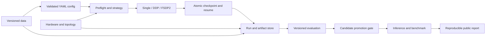

# TinyLLM-System

> A hardware-aware LLM training, evaluation, and deployment platform for consumer
> multi-GPU systems.

[](https://github.com/JayYu686/TinyLLM-System/actions/workflows/ci.yml)
[](https://www.python.org/downloads/)
[](LICENSE)

TinyLLM-System is an evidence-first PyTorch project built around a 10 × RTX 3090
workstation. It is designed to answer systems questions that a collection of fine-tuning
scripts cannot:

- Can every run be traced to an immutable config, dataset, tokenizer, commit, software
  environment, hardware inventory, checkpoint, and evaluation?
- Can interrupted single-GPU and distributed jobs resume from a validated checkpoint
  without silently changing state?
- When should a model use DDP, FSDP2, or ZeRO-3, given real memory and topology limits?
- Can a candidate model prove target-task improvement without hiding general regressions?
- Can a deployed artifact be traced back through evaluation and training lineage?

This is not a wrapper around Hugging Face Trainer, a claim to reimplement the full LLM
ecosystem, or a benchmark leaderboard. Measurements are published only after real runs;
missing results stay explicitly unevaluated.

## Current status

| Area | Status | Verified evidence |
| -- | -- | -- |
| M0 host readiness | Complete | 10 RTX 3090s inventoried; CUDA/BF16 single-GPU smoke passed |
| M0 collectives | Complete for readiness | 1/2/4/6-GPU NCCL correctness runs completed with zero reported correctness errors |
| M1 model foundation | Implemented | TinyGPT-Debug instantiates to 1,820,352 trainable parameters and passes CPU forward/backward tests |
| M1 single-device training | Complete | CPU Exact Resume and RTX 3090 BF16 SIGTERM/SIGKILL recovery pass |
| M2 licensed data pipeline | In progress | Pinned import, deterministic grouped split, and real Qwen3 tokenizer/mask smoke; no full dataset build or Baseline Evaluation yet |
| M3–M6 | Planned | No training-quality or scaling result is claimed yet |

The complete M0 evidence is in the
[acceptance record](reports/m0/m0_acceptance.md),
[host inventory](reports/hardware/rtx3090_inventory.md), and
[topology/NCCL report](reports/hardware/nccl_topology.md). M0 NCCL measurements prove
tooling and collective correctness under that test protocol; they are not DDP throughput
benchmarks.

M2 source availability and Dataset Card hashes are recorded in the
[pinned-source verification report](reports/m2/source_verification.md). This is import-contract
evidence only; it is not evidence of a completed data build or model training.
The [M2.2 deterministic pipeline smoke](reports/m2/deterministic_pipeline_smoke.md) uses synthetic
CC0 fixtures and likewise makes no full-dataset distribution or training claim.
The [pinned Qwen3 tokenizer smoke](reports/m2/qwen3_tokenizer_smoke.md) verifies real Token IDs and
Assistant-only labels without loading model weights.

The M1.1 native Trainer result is documented in the
[CPU correctness report](reports/m1/native_cpu_trainer_report.md). It is deliberately
separate from the [M1.2 checkpoint report](reports/m1/atomic_checkpoint_report.md) and
the [M1.3 Exact Resume report](reports/m1/exact_resume_report.md). The merged result is
summarized by the [M1 acceptance report](reports/m1/m1_acceptance.md).

## System boundary



The core release follows one lifecycle:

```text
data versioning
  → hardware-aware preflight
  → single/distributed training
  → checkpoint and failure recovery
  → evaluation and regression analysis
  → candidate promotion
  → inference performance gate
  → experiment reproduction
```

## Hardware strategy

The main server has 10 × RTX 3090 24 GB GPUs arranged across two NUMA nodes. The formal
scaling sequence is 1/2/4/8 GPUs. Eight is the standard training group because it gives a
conventional world size while reserving capacity for evaluation, development, and fault
recovery. Shared-server correctness smoke tests may select any explicit idle set, including
GPUs 4–9; those dynamic runs do not replace controlled 1/2/4/8 scaling results. Ten GPUs
are reserved for boundary experiments and cannot become the default silently.

The auxiliary 8 × V100 32 GB host is a conditional compatibility target. RTX 3090 uses
BF16 by default and may use TF32; V100 requires FP16 + GradScaler and must reject BF16.
No V100 result is claimed until access and a real smoke test exist.

Strategy meanings are deliberately narrow:

- **DDP** replicates model state and scales throughput when one GPU can hold the complete
  training state. Adding DDP ranks does not combine memory.
- **FSDP2** is the primary sharded implementation for parameters, gradients, optimizer
  state, distributed checkpoints, and native PyTorch recovery.
- **ZeRO-3** is a later comparison for DeepSpeed compatibility and optional offload. It
  starts only after the equivalent FSDP2 path passes.

## Quickstart

Python 3.11 is the supported development runtime. CPU setup is enough for the default
quality gate:

```bash
git clone https://github.com/JayYu686/TinyLLM-System.git
cd TinyLLM-System
make bootstrap-cpu
source .venv/bin/activate
tinyllm --help
tinyllm doctor --json
tinyllm train --config configs/pretrain/tinygpt_debug_cpu_smoke.yaml \
  --device cpu --output /tmp/tinyllm-runs --json
make check
```

On the RTX 3090 development host, install the isolated CUDA 11.8 profile instead:

```bash
make bootstrap-gpu
source .venv/bin/activate
tinyllm doctor --distributed --json
```

`doctor` is read-only and never launches a high-load NCCL benchmark. Review GPU
utilization, temperature, topology, storage, and software compatibility before running a
separate smoke test. Dependency profile semantics are documented in
[requirements/README.md](requirements/README.md).

## Stable CLI and contracts

The public command surface is staged by milestone:

```text
tinyllm doctor
tinyllm data prepare|inspect
tinyllm train
tinyllm run list|show|reproduce
tinyllm benchmark train
tinyllm eval
tinyllm compare
tinyllm promote
```

Buffer work adds `tinyllm plan`, `tinyllm serve`, and `tinyllm benchmark inference`.
Commands expose stable `--json` output and use these exit-code classes:

| Code | Meaning |
| --: | -- |
| 0 | Success |
| 2 | Invalid config or user input |
| 3 | Environment, hardware, or resource preflight failure |
| 4 | Training run failure |
| 5 | Checkpoint or resume integrity failure |
| 6 | Evaluation failure or promotion rejection |

Formal experiments start from schema-validated YAML. CLI overrides are limited to GPU
selection, output location, resume mode, and documented runtime fields. Public Pydantic
JSON Schema snapshots are committed under [schemas/](schemas/README.md); all models use
a version field and reject unknown fields.

## Run and checkpoint design

The private Artifact Store defaults to `/data/yujielun/tinyllm/`:

```text
cache/       shared downloads
datasets/    immutable dataset versions
models/      model inputs and deployment exports
runs/        JSON-first run directories
registry/    rebuildable query index and promotion records
```

A Run ID is `<UTC>-<slug>-<resolved-config-hash8>-<random4>`. Every run directory is
designed to contain:

```text
run.json                  environment.json
events.jsonl              hardware.json
config.original.yaml      metrics.jsonl
config.resolved.json      checkpoints/ evaluations/ exports/
```

JSON/JSONL artifacts are the fact source. SQLite, introduced in M6, is a rebuildable
query index; MLflow is an optional projection and never a training dependency.

Exact checkpoints include model, optimizer, scheduler, scaler, step/epoch, Python/NumPy/
PyTorch/CUDA RNG, sampler cursor, data/config/code/environment identity, world size,
per-file SHA256, and a completion marker. They are written to a temporary directory,
validated, atomically renamed, and only then published through `LATEST`. Exact, Warm, and
Transfer resume are separate operations. Safetensors exports are not training checkpoints.

## Career-oriented release train

The target is a ten-week core plus a two-week buffer:

| Milestone | Demonstrated capability | Core release role |
| -- | -- | -- |
| M1 | Native single-GPU trainer, atomic checkpoint, Exact Resume | Correctness base |
| M2 | Licensed deterministic data pipeline and frozen evaluation | Data lineage |
| M3 | Native DDP and controlled 1/2/4/8 scaling | First application-ready evidence |
| M4 | Qwen3-8B FSDP2 sharded checkpoint/resume smoke | Advanced distributed evidence |
| M5 | Qwen3-0.6B Full SFT and Qwen3-8B LoRA | Practical post-training |
| M6 | Baseline/candidate comparison and Candidate gate | `v0.6.0-rc.1` portfolio release |
| M7 | vLLM serving and measured inference gate | Buffer; required for Production |
| M8 | Static estimate plus short probe planner | Buffer differentiation |

M3 is the earliest job-application checkpoint. M7/M8, ZeRO-3, MLflow, V100 validation,
and TinyGPT-350M cannot block `v0.6.0-rc.1`. See the
[career release roadmap](docs/career_release_roadmap.md) and [full plan](PLANS.md).

## Evaluation and promotion

M6 compares the base and trained model on ARC-Easy, HellaSwag, PIQA, and a frozen
300-example domain set spanning Python, Linux, JSON/config, log diagnosis, and unsupported
claim refusal. The target Candidate gate requires:

- at least +3 percentage points on the domain aggregate with a bootstrap 95% confidence
  interval lower bound above zero;
- no more than 2 percentage points aggregate regression on general tasks;
- at least 98% JSON validity;
- complete data, model, checkpoint, environment, and evaluation lineage.

Thresholds are config, not README exceptions. A failed candidate stays Development, and
regressions and failure examples remain visible. Production promotion waits for M7's real
inference performance gate.

## Scope control

The core project does not implement custom CUDA kernels, custom FlashAttention, MoE,
custom KV cache, custom tensor parallel, multi-node or pipeline parallel training, full
RLHF, Kubernetes, billing, or a complex frontend. These are Future Work, research
challenges, or responsibilities of other projects. A generic FastAPI layer is not an
early milestone; M7 uses the native vLLM OpenAI-compatible API with a thin lineage-aware
launcher.

## Documentation

The public README is English. Detailed design documents currently remain Chinese so the
implementation constraints are accessible to the primary developer; public English
contracts and reports are added at release boundaries.

- [Contribution workflow](CONTRIBUTING.md)
- [Agent and review rules](AGENTS.md)
- [Milestone plan](PLANS.md) and [task summary](TASKS.md)
- [Architecture](docs/architecture.md), [training design](docs/training_design.md), and
  [M1 contract](docs/m1_training_contract.md)
- [Data contract](docs/dataset_contract.md), [evaluation spec](docs/evaluation_spec.md),
  and [experiment lineage](docs/experiment_lineage.md)
- [Hardware strategy](docs/hardware_strategy.md) and
  [benchmark policy](docs/benchmark_plan.md)
- [Public reporting policy](docs/public_reporting.md) and
  [security policy](SECURITY.md)

## License

Licensed under the [Apache License 2.0](LICENSE). Dataset and model licenses remain
independent; each registered dataset and published adapter must preserve its own source,
revision, and license metadata.
