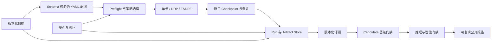

# TinyLLM-System

**简体中文** | [English](README.en.md)

> 面向消费级多 GPU 系统的硬件感知大语言模型训练、评测与部署平台。

[](https://github.com/JayYu686/TinyLLM-System/actions/workflows/ci.yml)
[](https://www.python.org/downloads/)
[](LICENSE)

TinyLLM-System 是一个以真实证据和可复现性为先的原生 PyTorch 项目，主要运行在
10 × RTX 3090 工作站上。它关注的不是“再写一组微调脚本”，而是回答以下训练系统问题：

- 每次 Run 能否追溯到不可变配置、数据集、Tokenizer、Git Commit、软件环境、硬件环境、
  Checkpoint 和评测结果？
- 单卡或分布式作业中断后，能否从经过完整性校验的 Checkpoint 恢复，并避免训练状态静默漂移？
- 面对真实显存和通信拓扑约束，什么时候应选择 DDP、FSDP2 或 ZeRO-3？
- 候选模型能否证明目标任务获得提升，同时如实呈现通用能力回退？
- 部署 Artifact 能否反向追溯到评测、Checkpoint、训练 Run 和数据版本？

本项目不是 Hugging Face Trainer 的简单包装，不试图从零重写整个 LLM 生态，也不是只展示
漂亮数字的 Benchmark 榜单。所有指标只能来自真实运行；尚未测量的结果会明确标记为未评估。

## 当前进度

| 模块 | 状态 | 已验证证据 |
| -- | -- | -- |
| M0 主机体检 | 已完成 | 已盘点 10 张 RTX 3090；CUDA/BF16 单卡 Smoke 通过 |
| M0 Collective | 就绪验证完成 | 已完成 1/2/4/6 卡 NCCL 正确性测试，未报告正确性错误 |
| M1 模型基础 | 已实现 | TinyGPT-Debug 实际包含 1,820,352 个可训练参数，并通过 CPU 前后向测试 |
| M1 单卡训练 | 已完成 | CPU Exact Resume 与 RTX 3090 BF16 SIGTERM/SIGKILL 恢复通过 |
| M2 数据与评测 | 已完成 | 不可变数据构建/重建、冻结 300 条领域集、Exact 污染扫描和完整 Qwen3 Baseline 通过 |
| M3 DDP | 已完成 | 正确性、Exact Resume/Rank Failure 和真实 1/2/4 卡扩展证据已在 PR #55 验收 |
| M4 FSDP2 | 进行中 | 两进程 CPU/Gloo Tiny Model 正确性已通过；尚无 CUDA、DCP、Qwen3-8B 或四卡结论 |
| M5–M6 | 计划中 | 尚未声明训练质量、模型晋级或部署结果 |

M0 的完整证据见 [验收记录](reports/m0/m0_acceptance.md)、
[RTX 3090 硬件报告](reports/hardware/rtx3090_inventory.md) 和
[拓扑/NCCL 报告](reports/hardware/nccl_topology.md)。M0 NCCL 数据只证明对应测试协议下的
工具可用性和 Collective 正确性，不等价于 DDP 训练吞吐。

M1 原生 Trainer 见 [CPU 正确性报告](reports/m1/native_cpu_trainer_report.md)，原子 Checkpoint
见 [M1.2 报告](reports/m1/atomic_checkpoint_report.md)，Exact Resume 见
[M1.3 报告](reports/m1/exact_resume_report.md)，合并结论见
[M1 验收报告](reports/m1/m1_acceptance.md)。

M2 固定数据源和 Dataset Card 哈希见
[数据源核验报告](reports/m2/source_verification.md)。完整的固定源数据构建见
[M2 全量数据报告](reports/m2/full_dataset_build.md)：真实数据产品为
`m2-sft-v1-f82ff32e`，并完成独立文件校验和相同内容身份的离线重建。
[300 条领域评测集](evals/domain/v1/README.md) 固定了 210/90 中英文比例、七类任务和
90 组双语任务对；[正式污染报告](reports/m2/domain_eval_contamination.md) 对 4,597 条已验证
Train 样本执行 Exact 全序列和 Prompt 前缀匹配，结果均为零，Near-Dedup 仍明确标记为
`not_evaluated`。Qwen3-0.6B 的完整训练前 Baseline 见
[正式 Baseline 报告](reports/m2/baseline_formal.md)，M2 最终身份和限制见
[M2 验收报告](reports/m2/m2_acceptance.md)。

M3.1 的真实单卡/双卡 torchrun 证据见
[DDP 正确性报告](reports/m3/ddp_correctness.md)，覆盖初始化、Sampler 分片、Global Batch、
Loss 聚合、最终参数同步和仅 Rank 0 持久化日志。M3.2 见
[DDP 恢复报告](reports/m3/ddp_recovery.md)，覆盖双卡完整 Checkpoint、Step 6 Exact Resume
和 Rank 1 在 Step 8 强制退出后的恢复。正式
[DDP 扩展报告](reports/m3/ddp_scaling.md) 保存真实 1/2/4 卡 Strong/Weak 矩阵、Profiler
观察到的 NCCL 通信和被 Preflight 拒绝的运行；项目不声称已经验证 8 卡或受控跨 NUMA 性能。

M4 的第一道 [FSDP2 CPU/Gloo 正确性报告](reports/m4/fsdp2_cpu_correctness.md) 验证两个
进程上的显式 CPU DeviceMesh、DTensor 分片覆盖、前后向、Optimizer Step、Loss Reduce、
完整状态重建和 World Size 错配拒绝。该证据不包含 CUDA、DCP、Qwen3-8B 或四卡结论。

## 系统主链路



核心发布链路为：

```text
数据版本化
  → 硬件感知 Preflight
  → 单卡/分布式训练
  → Checkpoint 与失败恢复
  → 评测和回归分析
  → Candidate 晋级
  → 推理性能门禁
  → 实验复现
```

## 硬件与分布式策略

主服务器包含跨两个 NUMA 节点的 10 × RTX 3090 24GB，但它是一台长期共享主机。核心发布
门禁因此使用经过协调的 1/2/4 卡嵌套空闲集合。8 卡和受控跨 NUMA 实验仅作为增强项：项目
不能抢占其他用户资源，也不能依赖没有上限的等待时间。公开报告始终记录实际 World Size，
不会把四卡数据外推为八卡或十卡结果。参见
[ADR-0004](docs/adr/0004-shared-server-4gpu-acceptance.md)。

辅助的 8 × V100 32GB 服务器只是条件式兼容目标。RTX 3090 默认使用 BF16，并可按配置启用
TF32；V100 必须使用 FP16 + GradScaler，并拒绝 BF16。在获得辅助服务器访问权限并完成真实
Smoke Test 前，本项目不声明任何 V100 结果。

三种策略的边界如下：

- **DDP**：完整训练状态能装入单卡时，通过模型复制扩展吞吐；增加 DDP Rank 不会合并显存。
- **FSDP2**：用于参数、梯度、优化器状态分片，以及 PyTorch 原生分布式 Checkpoint 和恢复。
- **ZeRO-3**：用于后续 DeepSpeed 兼容和可选 Offload 对照；只有对应 FSDP2 路径通过后才开始。

## 快速开始

项目开发环境固定为 Python 3.11。默认质量门禁只需要 CPU 环境：

```bash
git clone https://github.com/JayYu686/TinyLLM-System.git
cd TinyLLM-System
make bootstrap-cpu
source .venv/bin/activate
tinyllm --help
tinyllm doctor --json
tinyllm train --config configs/pretrain/tinygpt_debug_cpu_smoke.yaml \
  --device cpu --output /tmp/tinyllm-runs --json
make check
```

在 RTX 3090 开发服务器上使用隔离的 CUDA 11.8 Profile：

```bash
make bootstrap-gpu
source .venv/bin/activate
tinyllm doctor --distributed --json
```

`doctor` 是只读命令，不会自动启动高负载 NCCL Benchmark。执行独立 Smoke Test 前必须检查
GPU 利用率、温度、拓扑、磁盘和软件兼容性。依赖环境规则见
[requirements/README.md](requirements/README.md)。

## 稳定 CLI 与 Schema

公开 CLI 按里程碑逐步实现：

```text
tinyllm doctor
tinyllm data prepare|inspect
tinyllm train
tinyllm run list|show|reproduce
tinyllm benchmark train
tinyllm eval
tinyllm compare
tinyllm promote
```

缓冲阶段增加 `tinyllm plan`、`tinyllm serve` 和 `tinyllm benchmark inference`。命令提供稳定
`--json` 输出，并使用统一退出码：

| 退出码 | 含义 |
| --: | -- |
| 0 | 成功 |
| 2 | 配置或用户输入错误 |
| 3 | 环境、硬件或资源 Preflight 失败 |
| 4 | 训练运行失败 |
| 5 | Checkpoint 或 Resume 完整性失败 |
| 6 | 评测失败或 Promotion Gate 拒绝 |

正式实验必须从经过 Schema 校验的 YAML 启动。CLI 只允许覆盖 GPU、输出位置、Resume 模式和
已记录的少量运行时字段。Pydantic JSON Schema Snapshot 保存在
[schemas/](schemas/README.md)；所有公共 Schema 均带版本字段并拒绝未知字段。

## Run 与 Checkpoint 设计

私有 Artifact Store 默认位于 `/data/yujielun/tinyllm/`：

```text
cache/       共享下载缓存
datasets/    不可变数据版本
models/      模型输入和部署导出
runs/        以 JSON 为事实源的 Run 目录
registry/    可重建查询索引和晋级记录
```

Run ID 格式为 `<UTC>-<slug>-<resolved-config-hash8>-<random4>`。每个 Run 设计为保存：

```text
run.json                  environment.json
events.jsonl              hardware.json
config.original.yaml      metrics.jsonl
config.resolved.json      checkpoints/ evaluations/ exports/
```

JSON/JSONL 是事实源。M6 引入的 SQLite 只是可从目录重建的查询索引；MLflow 是可选投影，
永远不是训练依赖。

Exact Checkpoint 包含模型、优化器、Scheduler、Scaler、Step/Epoch、Python/NumPy/PyTorch/
CUDA RNG、Sampler Cursor、数据/配置/代码/环境身份、World Size、逐文件 SHA256 和完成标记。
系统先写临时目录，校验后原子 Rename，最后才原子更新 `LATEST`。Exact、Warm 和 Transfer
Resume 是不同操作；Safetensors 导出不是训练 Checkpoint。

## 求职导向发布路线

项目采用“十周核心 + 两周缓冲”的路线：

| 里程碑 | 证明的能力 | 核心发布作用 |
| -- | -- | -- |
| M1 | 原生单卡 Trainer、原子 Checkpoint、Exact Resume | 正确性基础 |
| M2 | 合法、确定性数据流水线和冻结评测 | 数据与评测血缘 |
| M3 | 原生 DDP 和受控 1/2/4 卡扩展 | 首个可正式投递版本 |
| M4 | Qwen3-8B FSDP2 分片 Checkpoint/Resume Smoke | 高级分布式证据 |
| M5 | Qwen3-0.6B Full SFT 和 Qwen3-8B LoRA | 实用后训练能力 |
| M6 | Base/Candidate 比较和 Candidate Gate | `v0.6.0-rc.1` 作品版本 |
| M7 | vLLM 服务和真实推理门禁 | 缓冲项；Production 的前置条件 |
| M8 | 静态估算与短 Probe Planner | 缓冲期差异化能力 |

M3 已达到开始正式投递的阶段。M7/M8、ZeRO-3、MLflow、V100 验证和 TinyGPT-350M
不得阻塞 `v0.6.0-rc.1`。完整路线见
[求职发布路线](docs/career_release_roadmap.md) 和 [项目计划](PLANS.md)。

## 评测与模型晋级

M6 将在 ARC-Easy、HellaSwag、PIQA 和冻结的 300 条领域集上比较 Base 与训练后模型。领域集
覆盖 Python、Linux、JSON/配置、日志诊断和无依据拒答。Candidate Gate 的目标是：

- 领域聚合分数至少提升 3 个百分点，且 Bootstrap 95% 置信区间下界大于零；
- 通用任务聚合下降不超过 2 个百分点；
- JSON Valid Rate 至少 98%；
- 数据、模型、Checkpoint、环境和评测血缘完整。

门禁阈值来自配置，不允许在 README 中临时找例外。未通过的候选模型保留 Development 状态，
并公开回退和失败样例。Production 晋级必须等待 M7 的真实推理性能门禁。

## 范围控制

核心项目不实现自研 CUDA Kernel、自研 FlashAttention、MoE、自研 KV Cache、自研 Tensor
Parallel、多节点/Pipeline Parallel、完整 RLHF、Kubernetes、计费或复杂前端。这些属于 Future
Work、研究挑战或其他项目职责。通用 FastAPI 不是早期里程碑；M7 使用 vLLM 原生
OpenAI-compatible API，并增加轻量的血缘感知启动包装。

## 文档入口

本文件是公开中文主入口，[README.en.md](README.en.md) 提供完整英文版本。面向项目维护者和
审查者的设计文档与报告以中文为主；稳定 CLI/Schema 字段和机器可读 JSON Key 保持英文。

- [贡献与 PR 流程](CONTRIBUTING.md)
- [Agent 与代码审查规则](AGENTS.md)
- [里程碑计划](PLANS.md) 与 [任务摘要](TASKS.md)
- [系统架构](docs/architecture.md)、[训练设计](docs/training_design.md) 与
  [M4 FSDP2 契约](docs/m4_fsdp2_contract.md)
- [数据契约](docs/dataset_contract.md)、[评测规范](docs/evaluation_spec.md) 与
  [实验血缘](docs/experiment_lineage.md)
- [硬件策略](docs/hardware_strategy.md) 与 [Benchmark 规范](docs/benchmark_plan.md)
- [公开报告规范](docs/public_reporting.md) 与 [安全策略](SECURITY.md)

## 许可证

项目采用 [Apache License 2.0](LICENSE)。数据集和模型许可证相互独立；每个注册数据集和公开
Adapter 都必须保留其来源、固定 Revision 和许可证元数据。
