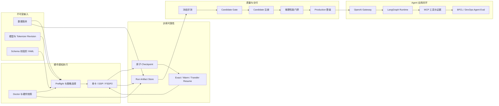
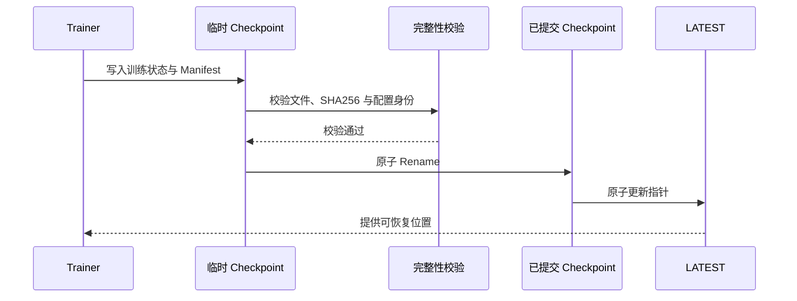
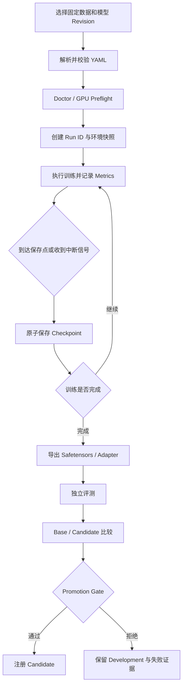

# TinyLLM-System

**简体中文** | [English](README.en.md)

> 面向消费级多 GPU 工作站的大模型后训练、Agent 应用评测与在线推理平台。

[](https://github.com/JayYu686/TinyLLM-System/actions/workflows/ci.yml)
[](https://www.python.org/downloads/)
[](LICENSE)

TinyLLM-System 将数据处理、训练策略、故障恢复、模型评测和版本晋级组织成一条可复现的
工程链路。项目以原生 PyTorch 为训练核心，主要运行在一台共享的 10 × RTX 3090 24GB
工作站上，并针对显存容量、GPU 拓扑和资源可用性选择单卡、DDP 或 FSDP2。M6 之后的工程
主线扩展到在线推理、Tool Calling、MCP、DevOps 单 Agent 及专用 Agent Evaluation。

系统为每次实验建立完整血缘：从固定的数据与模型 Revision、经过 Schema 校验的 YAML，
一直追踪到 Git Commit、软硬件环境、Checkpoint、评测结果和最终导出。公开结论均对应可复查
的真实运行记录，待验证能力会保留明确状态。

## 项目解决的问题

| 工程问题 | TinyLLM-System 的处理方式 |
| -- | -- |
| 一次训练由什么产生 | Run Manifest 绑定数据、Tokenizer、配置、代码、环境和硬件身份 |
| 共享 GPU 上如何安全启动 | `tinyllm doctor`、忙卡/温度检查、拓扑记录和策略 Preflight |
| 训练中断后如何继续 | 原子 Checkpoint、完整训练状态、完整性校验和显式 Resume 语义 |
| 多卡如何选择策略 | 单卡可容纳完整状态时使用 DDP；需要状态分片时使用 FSDP2 |
| 模型训练完成后如何判断价值 | 冻结评测、Base/Candidate 对照、回归分析和 Promotion Gate |
| 如何复现实验与部署模型 | Artifact Store 保存事实源，部署导出反向链接到训练与评测血缘 |

## 系统架构


```mermaid
flowchart LR
    subgraph Inputs["不可变输入"]
        D[数据版本]
        M[模型与 Tokenizer Revision]
        Y[Schema 校验的 YAML]
    end

    subgraph Planning["硬件感知执行"]
        H[Doctor 与硬件快照]
        P[Preflight 与策略选择]
        T[单卡 / DDP / FSDP2]
    end

    subgraph Reliability["训练可靠性"]
        C[原子 Checkpoint]
        R[Exact / Warm / Transfer Resume]
        A[Run Artifact Store]
    end

    subgraph Delivery["质量与交付"]
        E[冻结评测]
        G[Candidate Gate]
        Q[Candidate 注册]
        I[推理性能门禁]
        V[Production 晋级]
    end

    subgraph Agent["Agent 应用闭环"]
        O[OpenAI Gateway]
        L[LangGraph Runtime]
        X[MCP 工具与证据]
        J[BFCL / DevOps Agent Eval]
    end

    D --> P
    M --> P
    Y --> P
    H --> P
    P --> T
    T --> C
    C --> R
    R --> T
    T --> A
    D --> A
    H --> A
    A --> E
    E --> G
    G --> Q
    Q --> I
    I --> V
    V --> O
    O --> L
    L --> X
    X --> J
```

一条完整链路由以下阶段组成：

```text
数据版本化
  → 硬件体检与训练策略规划
  → 单卡或分布式训练
  → Checkpoint 与异常恢复
  → 自动评测和模型比较
  → Candidate 质量门禁
  → 推理性能门禁
  → 模型注册、部署与实验复现
```

## 核心能力

### 可追溯训练

- 正式实验从 Pydantic Schema 校验后的 YAML 启动。
- Run ID 由 UTC 时间、Slug、Resolved Config Hash 和随机后缀组成。
- `run.json`、`config.resolved.json`、`environment.json`、`hardware.json` 和
  `metrics.jsonl` 共同构成运行事实。
- 数据、模型和 Tokenizer 使用固定 Revision；配置漂移会改变实验身份。

### 可靠 Checkpoint 与恢复

- 单卡/DDP 保存完整 PyTorch 训练状态，FSDP2 使用
  `torch.distributed.checkpoint` 保存分片状态。
- Checkpoint 覆盖模型、优化器、Scheduler、Scaler、Step/Epoch、随机数状态、Sampler
  Cursor、数据版本、配置哈希、Git、环境、World Size 和逐文件 SHA256。
- 写入流程采用临时目录、完整性校验、原子 Rename 和原子 `LATEST` 更新。
- Exact、Warm、Transfer 三种恢复语义独立校验；Safetensors 用于部署导出。


```mermaid
sequenceDiagram
    participant T as Trainer
    participant TMP as 临时 Checkpoint
    participant V as 完整性校验
    participant CKPT as 已提交 Checkpoint
    participant L as LATEST

    T->>TMP: 写入训练状态与 Manifest
    TMP->>V: 校验文件、SHA256 与配置身份
    V-->>TMP: 校验通过
    TMP->>CKPT: 原子 Rename
    CKPT->>L: 原子更新指针
    L-->>T: 提供可恢复位置
```

### 硬件感知分布式训练

| 策略 | 状态分布 | 适用场景 | 当前项目状态 |
| -- | -- | -- | -- |
| 单卡 | 完整状态位于一张 GPU | 正确性基线、小模型训练与快速调试 | 已完成 |
| DDP | 每个 Rank 持有完整状态 | 模型状态可装入单卡，目标为吞吐扩展 | 已完成 1/2/4 卡验证 |
| FSDP2 | 参数、梯度和优化器状态分片 | 单卡显存容纳困难的大模型训练 | 已完成 Qwen3-8B 四卡验证 |
| ZeRO-3 | DeepSpeed 状态分片与可选 Offload | FSDP2 之后的工程和性能对照 | 增强阶段 |

### 数据、评测与晋级

- 原始数据经过规范化、许可过滤、去重、分组切分、Tokenization、Packing 和注册后进入训练。
- Dataset Manifest 保存输入哈希、处理配置、输出哈希、过滤统计和许可证分布。
- 评测集独立版本化，训练前冻结，并执行训练集污染检查。
- Base 与 Candidate 使用相同 Prompt Template、Tokenizer Revision 和解码配置。
- Promotion Gate 同时检查目标能力提升、通用能力回归、结构化输出质量和血缘完整性。

## 当前进度

| 里程碑 | 状态 | 已验证结果 |
| -- | -- | -- |
| M0 硬件体检 | 已完成 | 10 张 RTX 3090 盘点；单卡 CUDA/BF16 Smoke；1/2/4/6 卡 NCCL 正确性 |
| M1 单卡训练 | 已完成 | TinyGPT-Debug CPU 前后向；CPU Exact Resume；RTX 3090 BF16 SIGTERM/SIGKILL 恢复 |
| M2 数据与评测 | 已完成 | 固定源全量构建与离线重建；300 条冻结领域集；Exact 污染扫描；Qwen3-0.6B Baseline |
| M3 DDP | 已完成 | 初始化、Sampler、Loss Reduce、Rank 故障恢复和真实 1/2/4 卡扩展 |
| M4 FSDP2 | 已完成 | Qwen3-8B 四卡 BF16 FULL_SHARD；Step 25→50 DCP 恢复；Safetensors 独立加载 |
| M5 双模式 SFT | 已完成 | 0.6B 四卡 Full SFT 50M Token 与 8B BF16 LoRA 10M Token；两条路线均完成 Exact Resume、双模式评测和导出 |
| M6 评测与晋级 | 已完成 | 独立 v7 双模式评测与 160 条人工审查；11/11 门禁通过；0.6B Full-SFT 注册为 Candidate |
| M7 推理部署 | 已完成 | vLLM/Gateway 正式矩阵 18,000/18,000 请求成功；9/9 Production Gate 通过；0.6B 模型已晋级 Production |
| M8 DevOps Agent | 已完成 | Tool Calling 8/8；MCP、LangGraph、FTS5 证据检索、显式审批与重启恢复 |
| M9 Agent 评测 | 已完成 | 240 条 DevOps Agent Suite 冻结；三组父模型基线；BFCL 共 5,520/5,520 条且 0 推理失败 |
| M10 Agent 后训练 | 进行中 | M10.1 已冻结 1M 监督 Token 五来源混合；M10.2 单卡 0.6B Full SFT、阶段 Checkpoint/Resume 与真实 Preflight 已就绪，GPU 训练指标尚未评测 |

当前里程碑状态表示“代码、测试、Smoke、失败路径、真实报告和文档”组成的综合验收状态。
详细证据可从以下入口查看：

- [M0 验收](reports/m0/m0_acceptance.md)、
  [RTX 3090 清单](reports/hardware/rtx3090_inventory.md)、
  [拓扑与 NCCL](reports/hardware/nccl_topology.md)
- [M1 验收](reports/m1/m1_acceptance.md)、
  [原子 Checkpoint](reports/m1/atomic_checkpoint_report.md)、
  [Exact Resume](reports/m1/exact_resume_report.md)
- [M2 验收](reports/m2/m2_acceptance.md)、
  [全量数据构建](reports/m2/full_dataset_build.md)、
  [正式 Baseline](reports/m2/baseline_formal.md)
- [M3 DDP 正确性](reports/m3/ddp_correctness.md)、
  [故障恢复](reports/m3/ddp_recovery.md)、
  [扩展实验](reports/m3/ddp_scaling.md)
- [M4 FSDP2 正确性](reports/m4/fsdp2_cpu_correctness.md)、
  [DCP 恢复](reports/m4/fsdp2_dcp_recovery.md)、
  [Qwen3-8B 四卡实验](reports/m4/fsdp2_qwen3_8b_formal.md)
- [M5 双模式契约](docs/m5_sft_contract.md)、
  [M5.0 审查报告](reports/m5/m5_dual_mode_contract.md)、
  [M5.1 数据报告](reports/m5/m5_reasoning_data.md)、
  [M5.2 消融与选优报告](reports/m5/m5_ablation_selection.md)、
  [M5.2-R1 格式可靠性修正](reports/m5/m5_format_repair_r1.md)、
  [M5.2-R2 长度诊断报告](reports/m5/m5_r2_diagnostic.md)、
  [M5.2-R3 定向修复设计](docs/m5_r3_targeted_repair_design.md)、
  [M5.2-R3-P0 实验报告](reports/m5/m5_r3_p0.md)、
  [M5.2-R3-P0-R1 实验报告](reports/m5/m5_r3_p0_r1.md)、
  [M5.2-R3 Teacher 来源策略报告](reports/m5/m5_r3_teacher_source_strategy.md)、
  [M5.2-R3-P1 实验报告](reports/m5/m5_r3_p1.md)、
  [M5.2-R3-P2 实验报告](reports/m5/m5_r3_p2.md)、
  [M5.2-R3 内容审查结果](reports/m5/m5_r3_content_review.md)、
  [M5.2-R3 正式来源扩展](reports/m5/m5_r3_formal_source.md)、
  [M5.2-R3 训练门禁](reports/m5/m5_r3_training_gate.md)、
  [Thinking Budget 决策](docs/adr/0006-qwen3-thinking-budget-controller.md)、
  [Thinking Budget v2 门禁](reports/m5/m5_thinking_budget_v2.md)、
  [Qwen3-0.6B Full SFT 正式验收](reports/m5/m5_full_sft_formal.md)、
  [Qwen3-8B LoRA 正式验收](reports/m5/m5_lora_formal.md)、
  [M5 总验收](reports/m5/m5_acceptance.md)与
  [英文公开摘要](reports/m5/m5_public_summary.en.md)
- [M6 总验收](reports/m6/m6_acceptance.md)、
  [M6 英文公开摘要](reports/m6/m6_public_summary.en.md)、
  [M6 评测与晋级契约](docs/m6_evaluation_promotion_contract.md)、
  [M6 v1 门禁拒绝分析](reports/m6/m6_gate_rejection_analysis.md)、
  [双模式模板对齐决策](docs/adr/0007-qwen3-dual-mode-sft-template-alignment.md)与
  [10 分钟中文演示](docs/demo_m6.md)
- [M7 在线推理契约](docs/m7_serving_contract.md)与
  [M7.0/M7.1 基础审查报告](reports/m7/m7_foundation.md)、
  [M7 总验收](reports/m7/m7_acceptance.md)
- [M8 Agent 契约](docs/m8_agent_contract.md)、
  [M8 安全实践审查](reports/m8/security_best_practices.md)与
  [M8 总验收](reports/m8/m8_acceptance.md)
- [M9 评测契约](docs/m9_agent_evaluation.md)、
  [0.6B Agent Dev 基线](reports/m9/agent_dev_production_baseline.md)与
  [M9 总验收](reports/m9/m9_acceptance.md)
- [M10 Agent 后训练契约](docs/m10_agent_training_contract.md)与
  [M10.1 Agent 训练混合验收](reports/m10/m10_frozen_mixture.md)、
  [M10.2 Full SFT 工程就绪报告](reports/m10/m10_full_sft_readiness.md)

每份报告均标注适用范围。例如 M0 NCCL 测试记录 Collective 正确性，M3 报告负责训练吞吐；
四卡结果按实际 World Size 发布，性能结论以对应的真实实验为准。

## 一次 Run 如何流转


```mermaid
flowchart TD
    A[选择固定数据和模型 Revision] --> B[解析并校验 YAML]
    B --> C[Doctor / GPU Preflight]
    C --> D[创建 Run ID 与环境快照]
    D --> E[执行训练并记录 Metrics]
    E --> F{到达保存点或收到中断信号}
    F --> G[原子保存 Checkpoint]
    G --> H{训练是否完成}
    H -- 继续 --> E
    H -- 完成 --> I[导出 Safetensors / Adapter]
    I --> J[独立评测]
    J --> K[Base / Candidate 比较]
    K --> L{Promotion Gate}
    L -- 通过 --> M[注册 Candidate]
    L -- 拒绝 --> N[保留 Development 与失败证据]
```

这种组织方式让故障运行也成为可分析的工程证据：退出原因、最后有效 Checkpoint、恢复模式和
配置差异都会进入结构化记录。

## 硬件与资源策略

主开发服务器包含跨两个 NUMA 节点的 10 × RTX 3090 24GB，并由多个用户共享。正式扩展实验
使用经过协调的 1/2/4 卡空闲集合；动态 4–9 号卡可以承担 Smoke、短程训练和评测。8 卡、
10 卡和受控跨 NUMA 对照放入增强实验队列，所有报告记录实际 GPU 索引、World Size、拓扑、
温度和后台负载。

辅助目标为 8 × V100 32GB：

| 平台 | 默认精度 | 数值策略 | 角色 |
| -- | -- | -- | -- |
| RTX 3090 | BF16，可配置 TF32 | 通常无需 GradScaler | 主开发、训练、评测和部署 |
| V100 | FP16 | GradScaler | 获得访问权限后的兼容性验证 |

共享服务器上的 GPU 任务先经过资源 Preflight。忙卡拒绝同样会被保存为失败路径证据，避免
训练进程与其他用户争抢显存。

## 快速开始

项目开发环境固定为 Python 3.11。默认 CI 和核心逻辑可以在 CPU 环境验证：

```bash
git clone https://github.com/JayYu686/TinyLLM-System.git
cd TinyLLM-System
make bootstrap-cpu
source .venv/bin/activate

tinyllm --help
tinyllm doctor --json
tinyllm train \
  --config configs/pretrain/tinygpt_debug_cpu_smoke.yaml \
  --device cpu \
  --output /tmp/tinyllm-runs \
  --json

make check
```

RTX 3090 主机使用独立 CUDA 11.8 依赖 Profile：

```bash
make bootstrap-gpu
source .venv/bin/activate
tinyllm doctor --distributed --json
```

`tinyllm doctor` 采集只读环境信息。高负载 NCCL Smoke 与训练任务使用独立命令，并在启动前
确认 GPU 利用率、温度、拓扑、磁盘空间和依赖兼容性。环境说明见
[requirements/README.md](requirements/README.md)。

## CLI 与配置契约

公开命令面按里程碑逐步交付：

```text
tinyllm doctor
tinyllm data prepare|inspect
tinyllm train
tinyllm run rebuild|list|show
tinyllm benchmark train
tinyllm benchmark inference
tinyllm eval
tinyllm compare
tinyllm promote
tinyllm deploy resolve|show|promote|rollback
tinyllm serve
tinyllm agent run|approve|cancel
tinyllm agent index rebuild
```

`tinyllm agent eval` 随 M9 冻结评测契约交付。完整的 `tinyllm run reproduce` 和 Training
Planner 放入增强阶段。

命令提供稳定 `--json` 输出，便于 Shell、CI 和后续服务集成：

| 退出码 | 含义 |
| --: | -- |
| 0 | 成功 |
| 2 | 配置或用户输入错误 |
| 3 | 环境、硬件或资源 Preflight 失败 |
| 4 | 训练运行失败 |
| 5 | Checkpoint 或 Resume 完整性失败 |
| 6 | 评测失败或 Promotion Gate 拒绝 |
| 7 | Serving、Gateway、部署或模型加载失败 |
| 8 | Agent Runtime、MCP 或工具执行失败 |

CLI 覆盖范围集中在 GPU、输出位置、Resume 模式和少量运行时字段。实验定义保存在 YAML；
公共 Schema 均带版本字段、启用 `extra="forbid"`，并导出快照到
[schemas/](schemas/README.md)。

## Artifact Store

服务器上的私有 Artifact Store 由 `$TINYLLM_ARTIFACT_ROOT` 指定：

```text
$TINYLLM_ARTIFACT_ROOT/
├── cache/              # 数据、模型与评测资源缓存
├── datasets/           # 已注册的不可变数据版本
├── models/             # 模型输入与部署导出
├── runs/               # 训练 Run 与 Checkpoint
├── deployments/        # Serving 配置、环境、日志与 Benchmark
├── agent-runs/         # Agent Run 与可恢复事件
├── agent-evaluations/  # Agent Eval 原始证据
├── agent-sandboxes/    # 经审批的 Agent 专属写入副本
└── registry/           # Candidate、Production 与原子 Alias
```

典型 Run 目录：

```text
<run-id>/
├── run.json
├── events.jsonl
├── config.original.yaml
├── config.resolved.json
├── environment.json
├── hardware.json
├── metrics.jsonl
├── checkpoints/
├── evaluations/
└── exports/
```

JSON/JSONL 是事实源；SQLite 作为可从目录重建的查询索引，MLflow 可作为观测投影接入。
公开仓库保存脱敏报告和配置，原始日志、模型权重、数据文件和服务器身份留在私有 Artifact
Store。

## 仓库结构

```text
TinyLLM-System/
├── configs/       # 数据、训练、评测与 Benchmark YAML
├── docs/          # 架构、契约、ADR 和设计说明
├── evals/         # 版本化领域评测集
├── reports/       # 脱敏的真实运行与验收报告
├── schemas/       # 公共 Pydantic JSON Schema 快照
├── scripts/       # 可审查的构建、评测与证据脚本
├── src/tinyllm/   # Python 包、CLI 和核心实现
└── tests/         # 单元、集成、失败路径和 GPU Marker 测试
```

## 版本发布路线

项目按依赖顺序推进 M0–M10，每个阶段交付一个可以独立审查的系统能力：

| 阶段 | 交付能力 | 版本作用 |
| -- | -- | -- |
| M0 | 硬件清单、拓扑、Doctor 和 NCCL Readiness | 建立执行环境基线 |
| M1 | 原生单卡 Trainer、原子 Checkpoint、Exact Resume | 建立训练正确性 |
| M2 | 确定性数据流水线、污染检查和冻结评测 | 建立数据与评测血缘 |
| M3 | 原生 DDP、Rank 故障恢复和 1/2/4 卡扩展 | `v0.3.0-beta.1` 分布式基线 |
| M4 | Qwen3-8B FSDP2 分片训练与 DCP 恢复 | 建立大模型分片能力 |
| M5 | Qwen3 双模式 Full SFT 与 LoRA | 建立实际后训练链路 |
| M6 | Base/Candidate 比较和 Candidate Gate | `v0.6.0-rc.1` 候选版本 |
| M7 | vLLM 服务和真实推理门禁 | `v0.7.0` Production 版本 |
| M8 | Tool Calling、MCP 与 DevOps 单 Agent | `v0.8.0-beta.1` Agent Runtime |
| M9 | BFCL 与 DevOps Agent Evaluation | `v0.9.0-rc.1` Agent Readiness |
| M10 | Agent SFT/LoRA 与统一门禁 | `v1.0.0` 或 `v1.0.0-rc.1` |

Training Planner、ZeRO-3、MLflow、V100 兼容验证和 TinyGPT-350M 按核心链路依赖与资源条件
进入增强迭代。完整安排见[版本发布路线](docs/release_roadmap.md)。

## 评测与模型晋级

M6 使用 ARC-Easy、HellaSwag、PIQA 和冻结的 300 条领域集比较 Base 与训练后模型。领域集覆盖
Python、Linux、JSON/配置、日志诊断和无依据拒答，保存 Prompt Template、Tokenizer
Revision、解码配置、原始输出、评分依据和 Bootstrap 95% 置信区间。

最终 v7 Candidate Gate 的真实结果为：

| 指标 | Base | Candidate | 变化或结果 |
| -- | --: | --: | -- |
| Thinking 领域分数 | 34.33% | 41.67% | +7.34pp；95% CI `[+0.33, +14.29]pp` |
| Non-thinking 领域分数 | 22.33% | 40.67% | +18.34pp；95% CI `[+12.46, +24.40]pp` |
| 通用三任务等权 `acc_norm` | 51.80% | 54.48% | +2.68pp |
| Candidate 双模式 JSON Valid | — | 100% | 通过 |
| Thinking 格式/强制闭合 | — | 100% / 1.67% | 通过 |
| Non-thinking 可见推理泄漏 | — | 0/300 | 通过 |

预注册门禁要求：

- Thinking 与 Non-thinking 分别相对同模式 Base 提升至少 3 个百分点，且各自的 Cluster
  Bootstrap 95% 置信区间下界大于零；
- 通用任务聚合回退控制在 2 个百分点以内；
- 两种模式的 JSON Valid Rate 均达到 98%；
- Thinking 格式有效率达到 99% 且强制收束率不超过 10%，Non-thinking 可见推理泄漏为零；
- 数据、模型、Checkpoint、环境和评测血缘完整。

v1–v6 的拒绝证据保持不可变；v7 完成 160/160 人工复核并通过 11/11 门禁，模型已注册为
`qwen3-0-6b-m6-d16c2357` Candidate。该 Candidate 后续通过 M7 的 18,000 请求正式推理矩阵、
恢复、回滚和安全门禁，已作为 `qwen3-0-6b-m7-fa678d92` 晋级 Production；完整指标见
[M7 总验收](reports/m7/m7_acceptance.md)。

### Agent Readiness 基线

M9 在训练前冻结 80 条公开 Dev、160 条密封 Release 和 1,840 条固定 BFCL 离线核心任务。
三个父模型/历史对象的真实基线为：

| 对象 | DevOps Agent Dev Task Success | BFCL Offline Core Profile |
| -- | --: | --: |
| Qwen3-0.6B Production | 20.00%（两次运行一致） | 24.24%（446/1840） |
| Qwen3-8B Base | 36.25% | **39.18%（721/1840）** |
| Qwen3-8B 历史 LoRA | 36.25% | 36.25%（667/1840） |

三组 BFCL 共完成 5,520/5,520 条，正式推理失败为 0。8B Base 的 BFCL 总分比 0.6B 高
14.94pp，但 Missing Function 多轮任务仍只有 3.00%；三组 Agent Dev 的 Error Recovery 均为
0%。这些结果用于冻结 M10 的父模型起点和数据重点，不表示 Agent Candidate 已通过门禁。
完整分类结果、失败边界和原始哈希见 [M9 总验收](reports/m9/m9_acceptance.md)。

## 核心边界与后续研究

当前已完成版本覆盖单机单卡/多卡训练、数据版本化、Checkpoint、自动评测、Candidate 晋级、
在线推理、Production 门禁、能力受限的 DevOps Agent 和训练前 Agent Evaluation。M10 继续
交付 Agent 后训练与独立能力门禁。
以下方向位于后续研究清单：

- MoE、Pipeline Parallel 和多节点训练；
- 自研 KV Cache、Tensor Parallel、FlashAttention 与 CUDA Kernel；
- 完整 RLHF；
- Kubernetes、多租户计费和复杂前端管理系统。
- Multi-Agent、任意 Shell Agent、完整通用 MCP Host 与向量数据库。

M7 直接集成 vLLM 的 OpenAI-compatible API，并在其外层增加血缘感知的启动与 Benchmark
包装；M8 只提供有工具 Allowlist 和显式审批的 DevOps 单 Agent。范围管理依据见
[Future Work](docs/future/) 和 [ADR](docs/adr/)。

## 文档入口

本文件是公开中文主入口，[README.en.md](README.en.md) 提供英文版本。设计文档与人工审查
报告以中文为主；CLI、Schema 和机器可读 JSON Key 保持英文。

- [贡献、PR 与代码审查流程](CONTRIBUTING.md)
- [版本发布路线](docs/release_roadmap.md)与[能力证据映射](docs/capability_map.md)
- [系统架构](docs/architecture.md)、[训练设计](docs/training_design.md)与
  [M5 SFT 契约](docs/m5_sft_contract.md)、[M6 评测与晋级契约](docs/m6_evaluation_promotion_contract.md)
- [M7 在线推理与 Production 晋级契约](docs/m7_serving_contract.md)
- [M8 Tool Calling、MCP 与 DevOps Agent 契约](docs/m8_agent_contract.md)
- [数据契约](docs/dataset_contract.md)、[评测规范](docs/evaluation_spec.md)与
  [实验血缘](docs/experiment_lineage.md)
- [硬件策略](docs/hardware_strategy.md)与[Benchmark 规范](docs/benchmark_plan.md)
- [公开报告规范](docs/public_reporting.md)与[安全策略](SECURITY.md)

## 许可证

项目采用 [Apache License 2.0](LICENSE)。数据集与模型许可证独立管理；每个注册数据集和公开
Adapter 都保存来源、固定 Revision 和许可证元数据。
